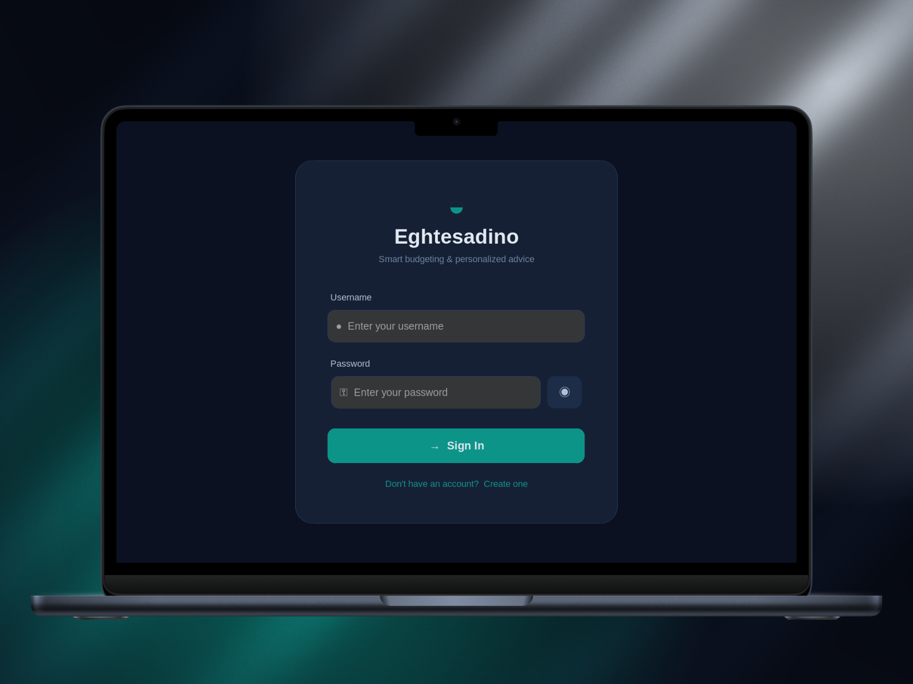
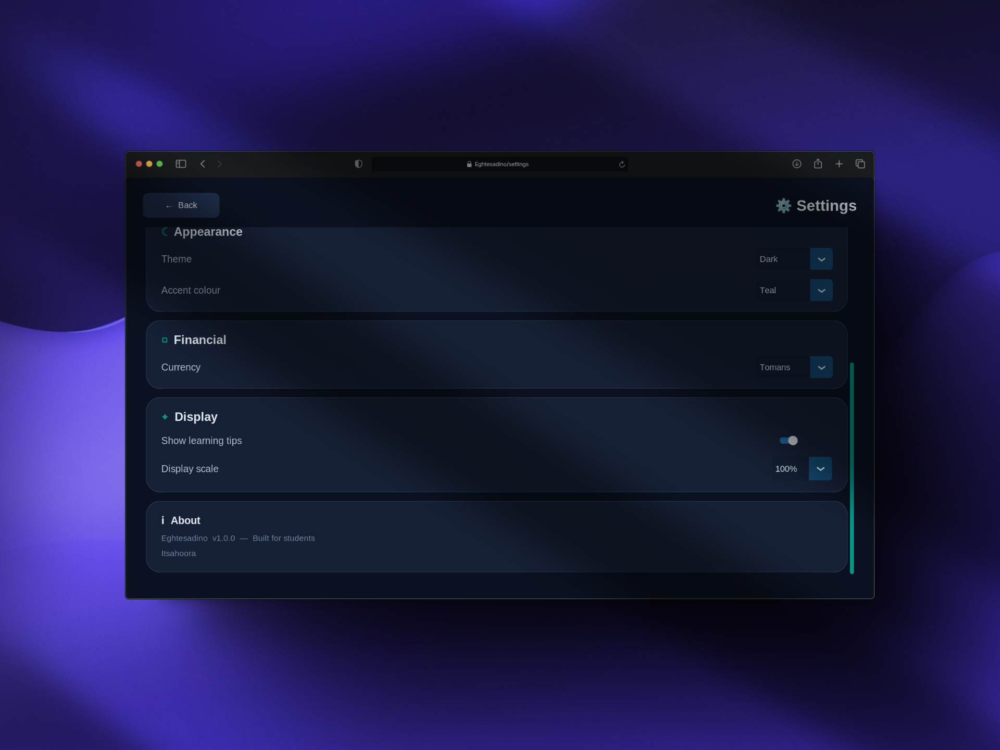
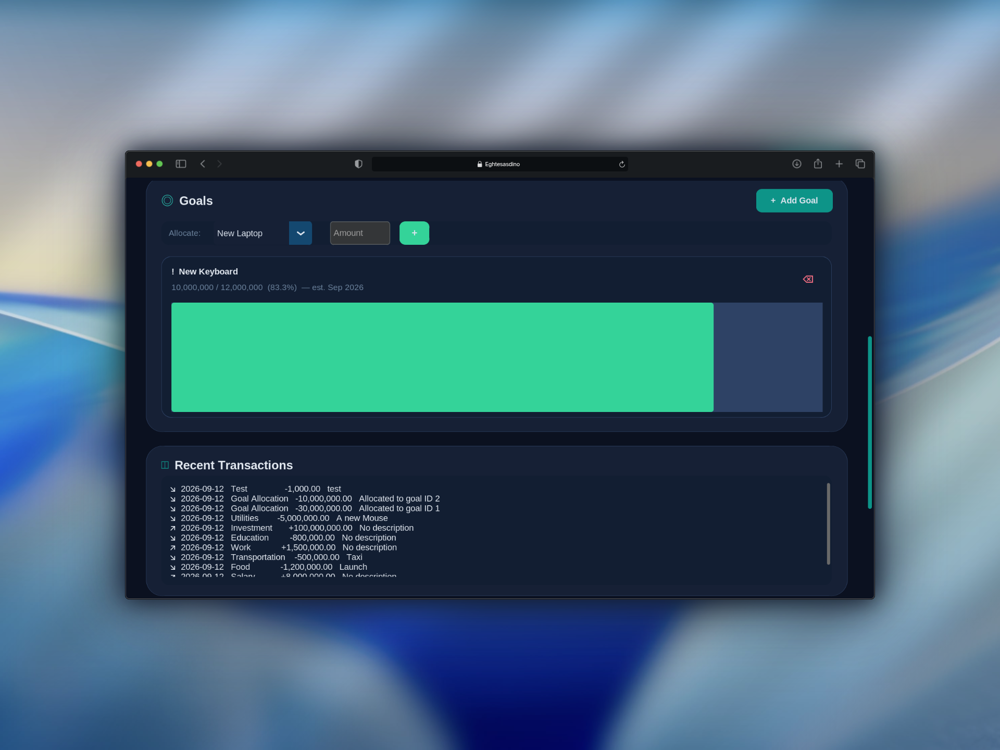
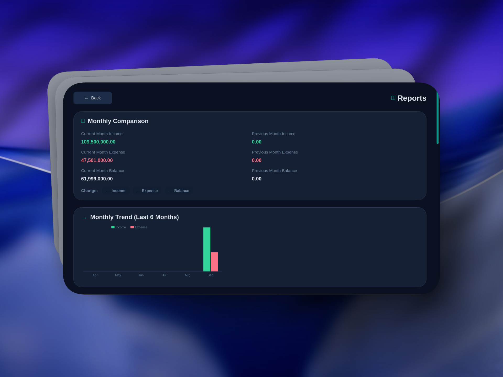
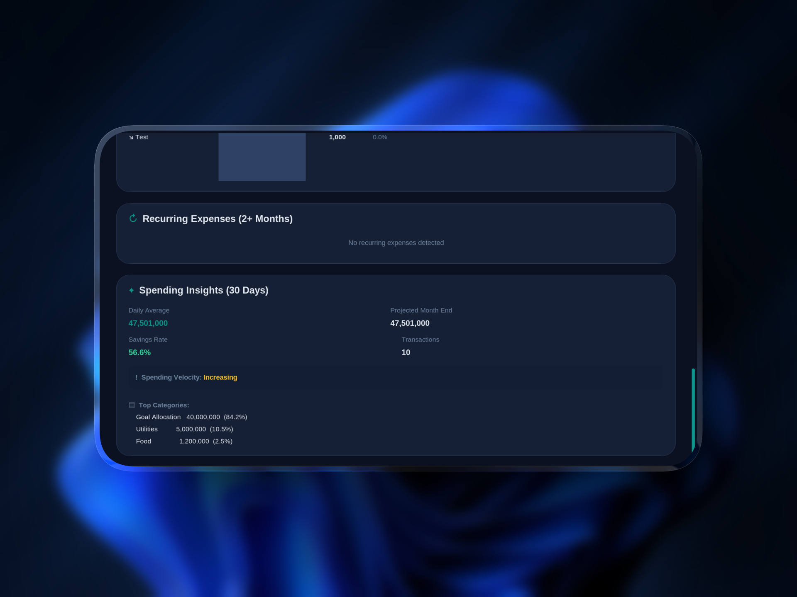

# Eghtesadino

Eghtesadino is a local desktop application for personal financial management. Built for students, it brings everyday money tracking, savings goals, reports, and practical financial guidance into one focused workspace.

This project is being developed in the context of the **Khwarizmi Youth Award**.

> Eghtesadino is an educational and personal tracking tool, not professional financial advice.

## Highlights

- **Accounts:** Register, sign in, update profile details, change a password, log out, or delete an account and its local data.
- **Transaction tracking:** Record income and expenses with categories, amounts, dates, and descriptions.
- **Dashboard:** See current balance, income, expenses, savings rate, spending trend, goals, recent transactions, alerts, and a financial-coach summary.
- **Goals:** Create savings goals with targets and deadlines, monitor progress, and allocate available balance toward them.
- **Reports:** Review month-to-month comparisons, a six-month income/expense trend, expense categories, recurring expenses, and 30-day spending insights.
- **Customization:** Switch between light and dark themes, choose an accent colour and currency, toggle learning tips, and adjust display scaling.

## Visual Showcase

| Sign in | Settings |
|---|---|
|  |  |

### Dashboard

| Overview | Goals & Transactions |
|---|---|
|  |  |

### Reports

| Monthly Overview | Spending Analysis |
|---|---|
|  |  |

## How It Works

The application starts in `main.py`, which creates the CustomTkinter window and routes between the login, dashboard, reports, goal, and settings screens. The `FinancialAdvisor` model owns SQLite operations and calculates balances, goal progress, spending summaries, trends, recurring expenses, alerts, and coaching text. Shared utilities provide theme colours, preferences, display scaling, reusable widgets, and resource-path handling.

All processing is local. The application does not require a server or online account.

## Technology Stack

- **Language:** Python 3.10+
- **Interface:** [CustomTkinter](https://github.com/TomSchimansky/CustomTkinter)
- **Storage:** SQLite 3 through Python's standard-library `sqlite3` module
- **Testing:** Python `unittest` feature tests and a theme smoke-test script
- **Build automation:** A GitHub Actions workflow for a Windows PyInstaller build

## Installation

Create and activate a virtual environment, then install the dependency listed in `requirements.txt`:

### Linux and macOS

```bash
python -m venv .venv
source .venv/bin/activate
python -m pip install -r requirements.txt
```

### Windows PowerShell

```powershell
python -m venv .venv
.venv\Scripts\Activate.ps1
python -m pip install -r requirements.txt
```

## Run

With the virtual environment active:

```bash
python main.py
```

On first launch, Eghtesadino creates `financial_data.db` in the application directory. A fresh clone does not need a database file included in the repository.

## Data and Privacy

Financial records are stored locally in SQLite. User preferences are stored locally in `user_prefs.json`, `user_scale.json`, and `user_theme.json`. These runtime files, along with databases, virtual environments, caches, and editor metadata, are excluded by `.gitignore`.

Because this is a local educational project, review the current storage implementation before using it for sensitive real-world financial information. The application does not provide cloud synchronization or online banking integration.

## Project Structure

```text
main.py                 Application entry point and screen router
models/                 FinancialAdvisor and SQLite data operations
screens/                Login, dashboard, goals, reports, and settings UI
utils/                  Preferences, themes, colours, scaling, and widgets
assets/screenshots/     Curated application screenshots
tests/                  Feature tests and theme smoke test
requirements.txt        Runtime dependency list
.github/workflows/      Windows build workflow
```

## Development and Validation

Run the theme smoke test with the project dependencies installed:

```bash
python tests/run_theme_tests.py
```

The feature suite can be run with:

```bash
python -m unittest discover -s tests -v
```

The repository contains `unittest` feature tests covering authentication, normalization, transactions, goals, analytics, and user isolation, together with a theme smoke-test script and a syntax-check command. The application itself makes no claim of encryption or other protection for stored data.

For a syntax-only check:

```bash
python -m compileall -q .
```

## Project Status

Eghtesadino is a working competition project under active development. The current version is suitable for local demonstration and continued development.

## License

Eghtesadino is released under the MIT License. See [LICENSE](LICENSE).
